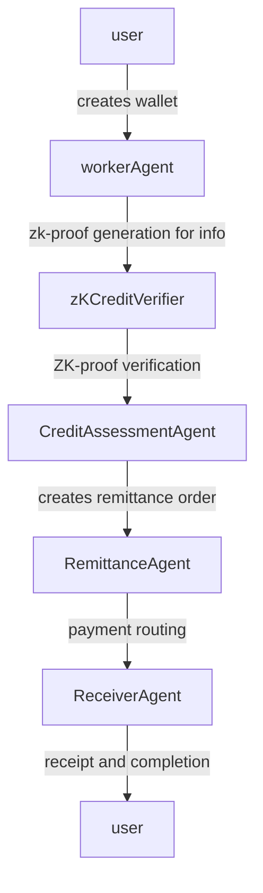

# 🏗️ ZKredit System Architecture

This document provides a comprehensive overview of the ZKredit system architecture, including detailed explanations of each component and how they interact to create a privacy-preserving credit assessment and remittance system.

## 📋 Table of Contents

- [System Overview](#system-overview)
- [Component Architecture](#component-architecture)
- [Data Flow](#data-flow)
- [Layer Structure](#layer-structure)
- [Agent System](#agent-system)
- [Zero-Knowledge Architecture](#zero-knowledge-architecture)
- [Blockchain Integration](#blockchain-integration)
- [Security Architecture](#security-architecture)
- [Scalability Design](#scalability-design)

## 🎯 System Overview

ZKredit is designed as a multi-layered, privacy-first system that enables users to prove their creditworthiness and access financial services without revealing sensitive financial information. The system combines:

- **Zero-Knowledge Proofs** for privacy preservation
- **Multi-Agent Architecture** for specialized processing
- **Blockchain Technology** for trustless verification
- **Advanced Cryptography** for secure computation

## 🏗️ Component Architecture

### High-Level Architecture

```
┌─────────────────────────────────────────────────────────────────┐
│                      User Interface Layer                        │
│  ┌─────────────────────────────────────────────────────────────┐ │
│  │                   Frontend Application                       │ │
│  │  - User Dashboards                                           │ │
│  │  - ZK Proof Visualization                                  │ │
│  │  - Application Forms                                        │ │
│  │  - Real-time Status Updates                                │ │
│  └─────────────────────────────────────────────────────────────┘ │
└─────────────────────────────────────────────────────────────────┘
                              │
                              ▼
┌─────────────────────────────────────────────────────────────────┐
│                     Application Layer                            │
│  ┌─────────────────────────────────────────────────────────────┐ │
│  │                  Agent Backend System                         │ │
│  │  ┌──────────────┬─────────────────┬──────────────────────┐ │ │
│  │  │ WorkerAgent  │ CreditAssessment │ RemittanceAgent     │ │ │
│  │  │              │ Agent            │                     │ │ │
│  │  │ - Identity   │ - ZK Validation  │ - Payment         │ │ │
│  │  │ - Onboarding │ - Risk Assessment│ - Routing         │ │ │
│  │  └──────────────┴─────────────────┴──────────────────────┘ │ │
│  └─────────────────────────────────────────────────────────────┘ │ │
└─────────────────────────────────────────────────────────────────┘
                              │
                              ▼
┌─────────────────────────────────────────────────────────────────┐
│                   Integration Layer                              │
│  ┌─────────────────────────────────────────────────────────────┐ │
│  │                Service Layer                                │ │
│  │  ┌──────────────┬─────────────────┬────────────────────┐ │ │
│  │  │ ZKProof     │ X402Payment     │ HCSAuditLogger    │ │ │
│  │  │ Service     │ Handler          │                   │ │ │
│  │  │ - Proof     │ - Fee            │ - Transaction      │ │ │
│  │  │ generation  │ processing       │ logging          │ │ │
│  │  └──────────────┴─────────────────┴────────────────────┘ │ │
│  └─────────────────────────────────────────────────────────────┘ │ │
└─────────────────────────────────────────────────────────────────┘
                              │
                              ▼
┌─────────────────────────────────────────────────────────────────┐
│                     Blockchain Layer                           │
│  ┌─────────────────────────────────────────────────────────────┐ │
│  │               Smart Contract Layer                          │ │
│  │  ┌──────────────┬─────────────────┬────────────────────┐ │ │
│  │  │ZKCredit     │ ERC-8004        │ Payment           │ │ │
│  │  │Verifier     │ Registries      │ Processors        │ │ │
│  │  ├──────────────┼─────────────────┼────────────────────┤ │ │
│  │  │• ZK Proof   │• KYC Registry   │• Fee Distribution │ │ │
│  │  │Verification │• Credit        │• Escrow Service    │ │ │
│  │  │• Credit     │  Registry     │• Refund System     │ │ │
│  │  │  Scoring    │• Reputation    │                    │ │ │
│  │  │              │  Registry     │                    │ │ │
│  │  └──────────────┴─────────────────┴────────────────────┘ │ │
│  └─────────────────────────────────────────────────────────────┘ │
└─────────────────────────────────────────────────────────────────┘
                              │
                              ▼
┌─────────────────────────────────────────────────────────────────┐
│                     Zero-Knowledge Layer                        │
│  ┌─────────────────────────────────────────────────────────────┐ │
│  │                  ZK Circuit System                          │ │
│  │  ┌──────────────┬─────────────────┬────────────────────┐ │ │
│  │  │ Income      │ Credit          │ Collateral        │ │ │
│  │  │ Verification│ History         │ Verification      │ │ │
│  │  │ Circuit     │ Circuit         │ Circuit           │ │ │
│  │  │             │                 │                   │ │ │
│  │  │• Proves     │• Verifies       │• Validates        │ │
│  │  │  income     │  credit        │  collateral       │ │
│  │  │  range      │  score         │  ownership        │ │
│  │  │  without    │  without       │  & valuation     │ │
│  │  │  revealing  │  revealing     │  without         │ │
│  │  │  amounts    │  details       │  revealing      │ │
│  │  │            │                │  details         │ │
│  │  └──────────────┴─────────────────┴────────────────────┘ │ │
│  └─────────────────────────────────────────────────────────────┘ │
└─────────────────────────────────────────────────────────────────┘
```

### Component Responsibilities

#### Frontend Layer
- **User Interface**: Intuitive dashboards for different user roles
- **ZK Visualization**: Real-time proof generation and verification status
- **Wallet Integration**: Web3 wallet connections and transaction signing
- **Application Processing**: Loan applications with document upload
- **Status Tracking**: Real-time updates on application and payment status

#### Agent Backend Layer
- **WorkerAgent**: Handles identity creation, onboarding, and proof generation
- **CreditAssessmentAgent**: Validates ZK proofs and performs risk assessment
- **RemittanceAgent**: Manages payment routing, fees, and compliance
- **ReceiverAgent**: Processes recipient verification and fund distribution
- **Service Layer**: Provides specialized services for ZK proofs, payments, and logging

#### Blockchain Layer
- **ZKCreditVerifier**: Main verification contract for all ZK proofs
- **ERC-8004 Registries**: Standardized registries for KYC, credit, and reputation
- **Payment Contracts**: Handles fee distribution, escrow, and refunds
- **Governance**: Contract upgrades and parameter management

#### ZK Layer
- **Income Verification Circuit**: Proves income range without revealing exact amounts
- **Credit History Circuit**: Verifies credit scores while preserving privacy
- **Collateral Verification Circuit**: Validates collateral ownership and value

## 🔄 Data Flow

### Asset Flow



### Component Interaction

```
┌─────┐     ┌─────┐     ┌─────┐     ┌─────┐     ┌─────┐
│User │────▶│Agent│────▶│ZK   │────▶│Smart│────▶│User │
│     │     │Sys  │     │Proof│     │Contract│     │     │
└─────┘     └─────┘     └─────┘     └─────┘     └─────┘
   │            │           │           │           │
   ▼            ▼           ▼           ▼           ▼
┌─────┐     ┌─────┐     ┌─────┐     ┌─────┐     ┌─────┐
│UI   │     │Serv │     │Circ │     │Chain│     │Fin  │
│     │     │ices │     │uits │     │     │     │     │
└─────┘     └─────┘     └─────┘     └─────┘     └─────┘
```

## 🎯 Agent System Architecture

### WorkerAgent
**Purpose**: User onboarding and identity management
**Key Functions**:
- Identity creation and verification
- Document processing and validation
- ZK proof generation for user credentials
- Application submission coordination

```typescript
class WorkerAgent {
  createIdentity(userData: UserData): Promise<Identity>
  generateZKProof(attributes: ZKAttributes): Promise<ZKProof>
  submitApplication(application: LoanApplication): Promise<ApplicationResult>
}
```

### CreditAssessmentAgent
**Purpose**: Credit analysis and risk assessment
**Key Functions**:
- ZK proof validation and verification
- Credit score calculation based on verified attributes
- Risk assessment and loan approval decision
- Fraud detection and prevention

```typescript
class CreditAssessmentAgent {
  verifyZKProof(proof: ZKProof): Promise<boolean>
  calculateCreditScore(attributes: VerifiedAttributes): Promise<CreditScore>
  assessRisk(creditData: CreditData): Promise<RiskAssessment>
  approveLoan(application: LoanApplication): Promise<LoanDecision>
}
```

### RemittanceAgent
**Purpose**: Payment processing and routing
**Key Functions**:
- Payment route optimization
- Fee calculation and distribution
- Compliance checking
- Escrow management

```typescript
class RemittanceAgent {
  optimizeRoute(remittance: RemittanceRequest): Promise<PaymentRoute>
  calculateFees(amount: Amount): Promise<FeeStructure>
  processPayment(payment: Payment): Promise<PaymentResult>
  manageEscrow(escrow: Escrow): Promise<EscrowResult>
}
```

### ReceiverAgent
**Purpose**: Recipient verification and fund distribution
**Key Functions**:
- Recipient identity verification
- Fund availability confirmation
- Transaction completion notification
- Dispute resolution initiation

```typescript
class ReceiverAgent {
  verifyRecipient(recipient: Recipient): Promise<VerificationResult>
  confirmFundAvailability(fund: Fund): Promise<FundStatus>
  completeTransaction(transaction: Transaction): Promise<TransactionResult>
  initiateDispute(dispute: Dispute): Promise<DisputeResolution>
}
```

## 🔐 Zero-Knowledge Architecture

### Circuit Design

#### Income Verification Circuit
```
Input: user_income, commitment, parameters
Private Input: salary_details, employment_verification
Public Input: income_range, commitment_proof
Output: verification_result

Logic:
1. Verify salary details are consistent with employment records
2. Prove income falls within specified range without revealing exact amount
3. Generate commitment to prevent double-spending
4. Provide range proof using Bulletproofs or similar zkSNARK technique
```

#### Credit History Circuit
```
Input: credit_data, zero_knowledge_proofs
Private Input: credit_history_data, credit_score
Public Input: credit_score_range, credit_approval_threshold
Output: credit_verification_result

Logic:
1. Validate credit history completeness
2. Compute credit score without revealing details
3. Prove score meets minimum threshold
4. Generate proof of eligibility for credit products
```

#### Collateral Verification Circuit
```
Input: asset, valuation, ownership
Private Input: ownership_documents, valuation_report
Public Input: collateral_value, lien_status
Output: collateral_verification_result

Logic:
1. Verify ownership documents are authentic
2. Validate asset valuation
3. Check for existing liens or encumbrances
4. Prove liquidation value
```

### Security Properties

1. **Zero-Knowledge**: Validators learn nothing beyond statement validity
2. **Completeness**: True statements always have corresponding proofs
3. **Soundness**: False statements cannot create valid proofs
4. **Non-Interactivity**: Proofs can be generated without real-time interaction
5. **Efficiency**: Proofs are computationally efficient to verify
6. **Composability**: Multiple proofs can be combined for complex verification

## 🔗 Blockchain Integration

### Contract Architecture

```
┌──────────────────────────────────────────────────────────────────┐
│                    ZKCreditVerifier.sol                          │
│                                                              │
│  ┌─────────────┐ ┌──────────────┐ ┌──────────────────────┐ │
│  │VerifyIncome │ │VerifyCredit    │ │VerifyCollateral      │ │
│  │             │ │                 │ │                       │ │
│  │• Range Check│ │• Score Range  │ │• Ownership Check     │ │
│  │• Time Lock  │ │• History      │ │• Valuation Range     │ │
│  │• Circuit    │ │• Blacklist    │ │• Circuit Verification│ │
│  └─────────────┘ └──────────────┘ └──────────────────────┘ │
│                                                              │
│  └─────────────────────────────────────────────────────────────┘
                                   │
                                   ▼
┌──────────────────────────────────────────────────────────────────┐
│                  ERC-8004 Registry Suite                          │
│                                                              │
│  ┌─────────────┐ ┌──────────────┐ ┌──────────────────────┐ │
│  │KYCRegistry  │ │CreditRegistry │ │ReputationRegistry    │ │
│  │             │ │                 │ │                       │ │
│  │• Identity   │ │• Credit Score │ │• Trust Score         │ │
│  │ Verification│ │• Loan History │ │• Transaction         │ │
│  │• Compliance│ │• Default      │ │  History              │ │
│  │  Check     │ │  History      │ │• Dispute Resolution  │ │
│  └─────────────┘ └──────────────┘ └──────────────────────┘ │
└──────────────────────────────────────────────────────────────────┘
```

### Integration Points

1. **ZK Verification**: All ZK proofs are verified on-chain for transparency
2. **Registry Updates**: Identity and credit data updated in registries
3. **Payment Processing**: Automated fee distribution and escrow management
4. **Audit Logging**: Immutable event logging for compliance and debugging
5. **Governance**: Parameter updates through governance mechanisms

## 🔒 Security Architecture

### Threat Model

| Threat Vector | Mitigation |
|---------------|------------|
| Sybil Attacks | Identity verification through KYC registration |
| Double-Spending | Commitment schemes with unique identifiers |
| Front-Running | Time-locks and fair ordering mechanisms |
| Data Leakage | Zero-knowledge proofs for sensitive data |
| DoS Attacks | Rate limiting and fee mechanisms |
| Contract Upgrades | Multi-signature governance with time delays |

### Security Features

1. **End-to-End Encryption**: All sensitive communication encrypted
2. **Zero-Knowledge Proofs**: Privacy-preserving verification
3. **Decentralized Identity**: User-controlled identity system
4. **Immutable Audit Trail**: All transactions logged immutably
5. **Rate Limiting**: Protection against abuse
6. **Access Control**: Role-based permissions system

## ⚡ Scalability Design

### Performance Optimizations

1. **Off-Chain Computation**: Heavy ZK proof generation done client-side
2. **Layered Verification**: Multi-level verification reduces on-chain load
3. **Batch Processing**: Multiple operations processed in single transactions
4. **State Channels**: Frequent interactions handled off-chain
5. **Caching Strategy**: Caching strategies for frequently accessed data

### Horizontal Scaling

1. **Microservices**: Each agent operates as independent service
2. **Event-Driven**: Asynchronous processing through event systems
3. **Load Balancing**: Multiple instances of services behind load balancers
4. **Database Sharding**: Data partitioned across multiple database nodes

## 📊 Monitoring and Observability

### Metrics Collection

1. **Transaction Metrics**: Success rates, processing times, fees
2. **Agent Performance**: Processing queue depth, response times
3. **ZK Proof Metrics**: Proof generation times, verification rates
4. **Security Metrics**: Attack attempts, fraud detection rates
5. **Business Metrics**: Volume of remittances, loan applications

### Alerting

1. **Security Incidents**: Anomalous behavior detection
2. **System Health**: Service availability and performance
3. **Business Logic**: Failed transactions and edge cases
4. **Compliance**: Regulatory violations and audit trail issues

## 🔧 Deployment Architecture

### Development Environment

```bash
# Local blockchain
ganache --port 8545 --accounts 10 --deterministic

# Contract deployment
forge script script/Deploy.s.sol:Deploy --rpc-url localhost:8545

# Frontend
pnpm run dev

# Agent backend
pnpm run agent:dev
```

### Production Environment

```
┌─────────────────────────────────────────────────────────────────┐
│                      Load Balancer                            │
└─────────────────────────────────────────────────────────────────┘
               │                             │
               ▼                             ▼
┌────────────────────────────────────┐ ┌────────────────────────┐
│        Web Server 1               │ │     Web Server 2       │
│   (Agent Backend)                 │ │  (Agent Backend)       │
└────────────────────────────────────┘ └────────────────────────┘
               │                             │
               ▼                             ▼
┌─────────────────────────────────────────────────────────────────┐
│                  Database Cluster                              │
│                  (PostgreSQL)                                  │
└─────────────────────────────────────────────────────────────────┘
               │
               ▼
┌─────────────────────────────────────────────────────────────────┐
│               Blockchain Network                                │
│              (Ethereum/Hedera)                                 │
└─────────────────────────────────────────────────────────────────┘
```

## 🔮 Future Enhancements

1. **Cross-Chain Compatibility**: Multi-chain deployment support
2. **Advanced ZK Techniques**: PLONK, HALO, and other efficient ZK systems
3. **Machine Learning Integration**: AI-powered risk assessment
4. **Mobile First Design**: Native mobile applications
5. **DeFi Integration**: Integration with DeFi protocols
6. **Central Bank Integration**: Integration with central bank digital currencies
